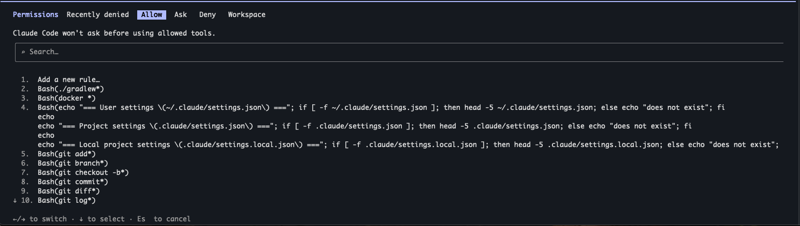

* Що це за проект (стек, розмір команди).

Даний проект є рішенням моєї проблеми запису і аналізу моїх сімейних фінансів.

Стек:
BE - Kotlin + Spring
FE - React
DB - PostgreSQL(може nosql була б простіша, але я звик)
Deploy - Hostinger

Команда:
Я один

* Який шлях обрав (A - з нуля або B - clone + adapt). Якщо B - який starter і що саме адаптував.

Я засетапив три рівні settings.json самостійно. Ця функціональність завжди для мене була незрозумілою, тож хотів попрактикуватись.
Адаптував я це все наступним чином - я ввімкнув accept edits мод у клода і намагався робити роботу по проекту(створювати тестові файли,
робити зміни, читати, піднімати докер і т п). Як тільки клод просив в мене дозвіл на ті екшени, які я вважаю він має робити
самостійно, або навпаки - робив те, що я б хотів він запитував - я міняв налаштування.

Які з 4 рівнів закрив і чому саме на цій глибині.

Закрив три рівні. Почав імплементувати devcontainers, для того щоб розібратись що це, але вирішив це зараз не робити. 
Не бачу для себе практичного сенсу ані зараз, ані на роботі. На роботі ми використовуємо інший підхід для запуску агентів
в обмеженому і передналаштованому оточенні.

Одне рішення з config яке вважаєш найбільш важливим для своєї ситуації.

Не впевнений, що зараз зможу відповісти на це - в ході імплементації проекту я впевнений я буду стикатись з певними блокерами
і адаптувати settings.json. Тоді я зможу сказати що було найважливішим.

Output make verify (для Шляху B) або скрін як /permissions показує твої правила (для Шляху A).
